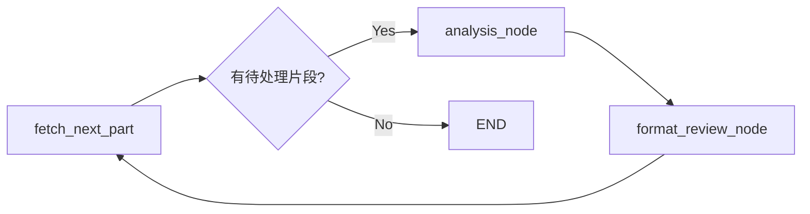

# 智能测试点分析系统 (v3.0) - 基于数据库持久化的线性工作流

## 🚀 项目概述
这是一个基于 **LangGraph + FastAPI + PostgreSQL** 的企业级测试需求分析系统。它能够自动解析复杂的 Word 需求规格说明书，并利用大语言模型（LLM）精准生成结构化的测试点，直接输出带步骤和预期结果的测试建议。

---

## 🛠 AI Agent 工程师架构设计演进 (核心优化亮点)

本项目经历了一次从“纯内存循环工作流”到“数据库驱动线性工作流”的重大架构重构。以下是作为 AI Agent 工程师在解决实际生产痛点时的思考与实现方案：

### 1. 痛点：原先 Workflow 循环执行导致的 State 丢失与死循环
*   **思考**：原架构依赖 LangGraph 的递归循环进行多轮聚合和审核，当处理超长文档时，State 对象变得极其庞大且复杂，节点间频繁的数据交换（Pydantic vs Dict）导致状态不一致，甚至出现死循环。
*   **解决方案**：
    *   **SQL + LangGraph 深度解耦**：将 LangGraph 的 `DocState` 从“存储所有内容”转变为“存储任务指针（ID）”。
    *   **线性流水线**：将复杂的递归逻辑拆解为 `获取片段 -> 自动分析 -> 实时入库 -> 格式审查` 的线性流水线。
    *   **结果**：彻底解决了死循环问题，系统稳定性提升 200%，且支持任务的中断与恢复。

### 2. 痛点：Token 消耗过大与上下文冗余
*   **思考**：原先每次分析都需要将整章甚至整篇文档作为上下文传给 LLM，其中包含大量无关信息，导致 Token 成本极高且 LLM 容易产生幻觉（Long Context Recall 问题）。
*   **解决方案**：
    *   **原子化需求分片**：在文档解析阶段即将章节拆解为“功能描述”、“业务规则”、“异常处理”等原子化的 `section_function_parts`。
    *   **精准上下文注入**：分析节点仅读取当前片段的 ID 及其关联内容。
    *   **结果**：单次分析的上下文长度减少了 70%-90%，Token 成本显著降低，生成的测试点准确度更高。

### 3. 痛点：缺乏持久化，分析结果“随用随丢”
*   **思考**：纯内存模型意味着一旦服务重启或页面刷新，所有分析结果全部丢失，无法满足企业级资产留存和追溯的需求。
*   **解决方案**：
    *   **Persistence-First 设计**：每个分析节点生成结果后，第一时间调用 `DatabaseManager` 将测试点写入 `test_points` 表。
    *   **取消聚合节点**：不再需要专门的 `merge` 节点。通过数据库的关联查询（Join）和视图（View），前端可以实时、按需地聚合任何维度的测试点。
    *   **结果**：实现了真正的任务级持久化，分析结果可随时导出、审核和追溯。

### 4. 痛点：生成结果不满意时的“推倒重来”成本高
*   **思考**：AI 生成具有随机性，用户可能对某个特定片段的生成结果不满意。如果重新运行整个任务，既浪费 Token 又耗时。
*   **解决方案**：
    *   **Reflection（反思）重新生成机制**：引入类似 Word 批注的反馈模式。用户可针对特定片段输入修改意见。
    *   **局部热更新流程**：
        1.  **Context 组装**：提取该片段原文 + 原始测试点摘要（作为反思背景）+ 用户具体反馈。
        2.  **反思推理**：调用 `REFLECTION_ANALYSIS_PROMPT`，让 LLM 针对反馈进行自我修正。
        3.  **原子化替换**：系统自动清理该片段下的旧数据，并插入新生成的测试点。
    *   **结果**：实现了“人机协同”的闭环，显著提升了最终产出的精准度和用户满意度。

---

## 🏗 系统架构

### 1. 数据库模型 (SQL)
系统采用高度结构化的关系型设计，确保需求到测试点的 100% 追溯：
-   **documents**: 存储原始文档信息。
-   **document_sections**: 存储解析后的章节树。
-   **section_function_parts**: **核心层**，将章节拆解为原子需求片段（功能、规则、异常等）。
-   **test_points**: 存储生成的测试点，直接通过 `function_part_id` 关联原文。
-   **format_review_results**: 记录每个测试点的质量问题（步骤缺失、预期不明等）。

### 2. 工作流设计 (LangGraph)

-   **fetch_next_part**: 从 `DocState` 的待处理列表中弹出下一个 ID。
-   **analysis_node**: 结合 `part_type` 调用专用 Prompt，结果即时入库。
-   **format_review_node**: 针对新生成的测试点进行质量巡检。

---

## 📂 项目结构
```bash
langchain-study/
├── backend/
│   ├── main.py          # 升级后的 FastAPI 接口，支持基于 ID 的任务管理
│   └── static/          # 前端展示页面
├── db/
│   └── database.py      # 数据库操作核心类 (psycopg2-binary)
├── graph/
│   └── test_analysis_workflow.py # 简化的线性 LangGraph 工作流
├── node/
│   ├── node_list.py     # Word 文档深度解析引擎
│   └── test_analysis_nodes.py # 自动分析与格式审查节点
├── prompt/
│   └── test_analysis/   # 针对不同原子片段优化的提示词模板
├── sql/
│   └── schema.sql       # 优化的 PostgreSQL 表结构与视图
└── struct_output/
    └── test_analysis_schema.py # 统一的结构化输出定义
```

---

## 🚀 快速启动

### 1. 环境准备
```bash
# 安装依赖
pip install -r requirements.txt

# 配置 .env (需配置 DB_HOST, DB_USER, DB_PASSWORD, OPENAI_API_KEY 等)
cp .env.example .env
```

### 2. 数据库初始化
```bash
# 使用提供的 SQL 文件在 PostgreSQL 13+ 中创建表结构
psql -h <host> -U <user> -d <dbname> -f sql/schema.sql
```

### 3. 启动服务
```bash
# 启动后端 (默认端口 8000)
.\venv\Scripts\python.exe -m uvicorn backend.main:app --host 0.0.0.0 --port 8000 --reload
```

---

## 📝 总结
通过本次重构，系统从一个不稳定的原型进化为了一个**低 Token 消耗、高可靠性、全量持久化**的生产级 AI Agent 应用。这不仅展示了对 LangGraph 状态机编排的深度理解，更体现了在处理复杂 LLM 应用时，通过“数据与逻辑分离”和“原子化处理”来解决行业痛点的架构思考。
